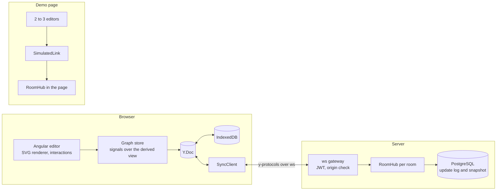
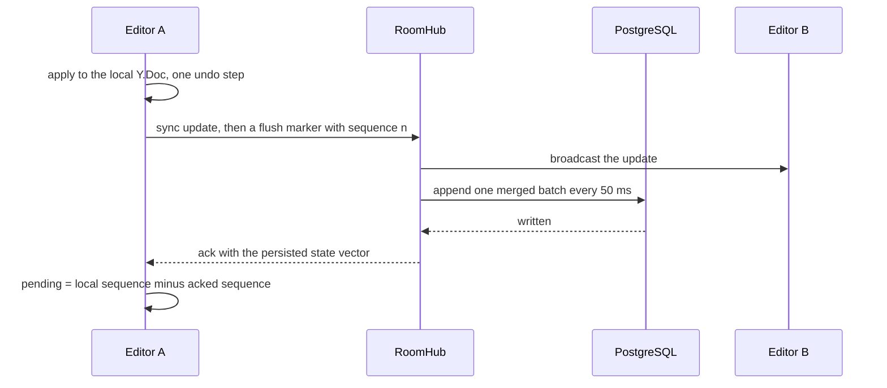

# coschema

A real-time collaborative diagram editor with live cursors, offline editing, per-user undo and a network simulator that checks every client ends up with the same, valid diagram.


Live demo: not deployed yet. <!-- ADRIAN: paste the URL of the deployed demo here -->

[](https://github.com/adrianturbinski/coschema/actions/workflows/ci.yml)

[](LICENSE)

The GIF is the `/demo` page: two editors, each behind its own simulated network link with latency, jitter and packet loss sliders and an offline switch. Ada goes offline, both people edit, the link comes back and the two copies merge. After that you see the cursors and follow mode. The recording script is `bench/demo-gif/main.ts`.

## Why I built this

Diagram editors are my day job. I work on software that generates single-line diagrams of high-voltage electrical substations, with Angular and diagram rendering on the front end and Java and Quarkus behind it. In real teams several people edit the same diagram at the same time.

I wanted the hard parts of collaboration: keeping a graph valid when two people change it at once, undoing only your own edits, and merging offline work cleanly. The editor is also keyboard operable and announces remote changes to screen readers, because collaborative canvases rarely are. <!-- ADRIAN: add one or two sentences about a concrete moment at work where two people edited one diagram, if you want one -->

## What is hard about it

1. A graph can become invalid without anyone doing anything wrong. One person connects an edge to a node while another deletes that node. I let the shared document hold the invalid state and hide it in a derived view that never writes, so no client repairs anything and nothing storms ([ADR 0007](docs/adr/0007-graph-validity-at-read-time.md)).
2. Undo has to mean "undo what I did". Each client has its own undo manager that tracks only local changes, and a drag is one step however many pointer moves it produced. Undoing my move does not revert someone's later label edit, because position and label are separate keys ([ADR 0008](docs/adr/0008-per-user-undo.md)).
3. Proving convergence. A deterministic simulator runs the real server logic and the real client with 2 to 8 clients over a network that delays, reorders, duplicates and drops messages and cuts clients off, then heals the network and compares every document byte for byte. A failing run prints its seed and replays exactly ([ADR 0012](docs/adr/0012-convergence-simulator.md)).
4. y-protocols has no acknowledgement, but an offline indicator needs a count of updates that are not safe yet. I added an ack to the wire protocol and count pending updates as the difference between the local sequence and the acknowledged one ([ADR 0009](docs/adr/0009-wire-protocol-and-auth.md)).
5. 5,000 nodes in SVG at 60 fps. One world transform, a grid index that gives a stable visible window, three levels of detail and a whole-scene overview below zoom 0.25. The benchmark was written first and it failed at 22 fps before the renderer changed ([ADR 0014](docs/adr/0014-svg-rendering-and-culling.md)).

## How it works



`RoomHub` and `SyncClient` are the only places that implement sync behaviour. The Node server, the convergence simulator (on a virtual clock) and the demo page all reuse them, so a green simulator says something about the product ([ADR 0011](docs/adr/0011-transport-abstraction-and-in-browser-hub.md)).

One edit travels like this:



The pieces with some maths in them:

- Convergence. After the network heals, for any two clients $i$ and $j$ the state vectors are equal, the encoded documents are equal, and the derived graph $G$ is equal and valid: $SV_i = SV_j$ and $G(D_i) = G(D_j)$. The simulator asserts this on every seed.
- Pending updates. $\text{pending} = \text{localSeq} - \text{ackedSeq}$. The hub acknowledges a marker only after everything it applied before the marker is persisted.
- Remote cursors arrive about 20 times a second and are drawn at 60 fps. Every frame each cursor moves toward its latest target $q$ with frame rate independent smoothing, $p \leftarrow p + \alpha\,(q - p)$ with $\alpha = 1 - 2^{-\Delta t / \tau}$ and a half life $\tau = 45$ ms.
- Edge routing is A* over a sparse grid built from the edges of the obstacles. The cost of a path is its length plus 24 for every bend, $g = \text{length} + 24 \cdot \text{bends}$, and the heuristic is the Manhattan distance. Routes are computed from the document and never stored, so every client draws the same ones without sending them ([ADR 0015](docs/adr/0015-orthogonal-routing-on-a-sparse-grid.md)).
- Z-order uses fractional keys over the base 62 alphabet. For neighbours $a < b$, `between(a, b)` returns a key $k$ with $a < k < b$ plus a random four digit suffix, so two people inserting into the same gap get different keys ([ADR 0006](docs/adr/0006-z-order-with-fractional-indexing.md)).

## Validation and benchmarks

Every number below is printed by `pnpm report` from the JSON files in `bench/results`, which the scripts in `bench/` and the simulator wrote on one machine. Each file carries the hardware, the Node version, the browser and the git revision it was measured on.

```
CPU: 12th Gen Intel(R) Core(TM) i7-12700H, 20 logical cores, 15.5 GiB RAM
OS: linux 6.6.87.2-microsoft-standard-WSL2
Node v24.21.0, chromium 153.0.8010.12 (headless), PostgreSQL 18.6
```

It is a laptop under WSL2 with other jobs running now and then, and the browser runs headless on localhost. Treat them as numbers for this machine. The panning numbers in particular need an idle machine: an earlier run of the same build while other builds were running dropped below 60 fps at the busiest zoom ([ADR 0014](docs/adr/0014-svg-rendering-and-culling.md)).

### Convergence simulator

`pnpm sim --seeds 5000` prints `seeds=5,000 failed=0 duration=76.3s` (65.5 seeds per second). Over those seeds the simulated network carried 1,756,564 messages, lost 12,715 of them and duplicated 6,418. CI runs the same 5,000 seeds with a time budget, a 500 run fast-check property, and a run with an injected bug that must fail. The details of the check are in [ADR 0012](docs/adr/0012-convergence-simulator.md).

### Edit to remote render, on localhost

The target is a p95 under 200 ms. Two browser contexts in one room, 200 edits after 10 warm-up edits, measured from the writer's pointer release to the changed pixels in the reader.

| Store | Edits | p50 ms | p95 ms | p99 ms | max ms |
| --- | --- | --- | --- | --- | --- |
| memory | 200 | 14 | 15 | 18 | 30 |
| postgres | 200 | 14 | 15 | 16 | 17 |

### Panning with 5,000 nodes

The target is 60 fps. Three runs per zoom level with synthetic wheel events. Below zoom 0.25 the whole scene is drawn as a handful of paths, so no nodes are in the DOM.

| Zoom | Nodes in the DOM | Median fps | Worst run fps |
| --- | --- | --- | --- |
| 1 | 99 | 60 | 60 |
| 0.75 | 121 | 60 | 60 |
| 0.5 | 182 | 60 | 60 |
| 0.35 | 358 | 60 | 60 |
| 0.25 | 579 | 60 | 60 |
| 0.2 | 0 | 60 | 60 |
| 0.1 | 0 | 60 | 60 |
| 0.05 | 0 | 60 | 60 |

### Load test

50 rooms with 10 clients each, 5 windows of 6 seconds, PostgreSQL store, one server process: 1,991.03 operations per second. Delivery from a write in one client to the observer of another had p50 0.61 ms, p95 3.73 ms and p99 11.76 ms. The persistence ack took 57.83 ms at p95, which includes the 50 ms batch window. All 50 rooms converged and nobody was disconnected. The server used 56.48% of one core and peaked at 204.57 MiB. This says nothing about several server instances.

### Document size before and after compaction

| Nodes | Edges | Log updates | Log bytes | Snapshot bytes | Smaller by |
| --- | --- | --- | --- | --- | --- |
| 93 | 113 | 711 | 50,371 | 29,944 | 1.68x |
| 951 | 1,292 | 7,338 | 563,434 | 349,802 | 1.61x |
| 4,743 | 6,633 | 36,551 | 3,140,913 | 2,117,861 | 1.48x |

The scenes are generated with random edits including deletes, which is why the largest one has 4,743 nodes. The gain is modest because a Yjs document keeps its tombstones and its client ids.

### Routing

| Nodes | Edges | Route every edge, median ms | Move one node and reroute, p95 ms |
| --- | --- | --- | --- |
| 100 | 135 | 4.31 | 0.52 |
| 1,000 | 1,428 | 26.26 | 0.54 |
| 5,000 | 7,353 | 159.45 | 0.2 |

### Accessibility

Lighthouse 13.5.0 scores accessibility 100 on `/`, `/r/test` and `/demo`, on both the desktop and the mobile setting, with no failed audit. A score is not the same as a pleasant experience, and nobody has checked the editor with a real screen reader yet.

## Run it locally

```
git clone https://github.com/adrianturbinski/coschema.git
cd coschema
docker compose up --build
```

That starts PostgreSQL, the sync server and the editor behind nginx. Open <http://127.0.0.1:4280/demo> for the side by side demo, or <http://127.0.0.1:4280/r/my-room> in two tabs for a room that goes through the server and the database. Press Ctrl+C to stop, and `docker compose down -v` to remove the database volume. Everything binds to 127.0.0.1.

To work on the code you need Node 24 (see `.nvmrc`) and pnpm, which Corepack provides:

```
corepack enable
pnpm install --frozen-lockfile
pnpm --filter @coschema/editor start
```

The dev server is at <http://127.0.0.1:4217>. The editor in dev mode does not proxy the socket, so for a room use `?server=http://127.0.0.1:4218` with a server started from `apps/server`. `.env.example` lists every setting.

## Tests

| Command | What it covers |
| --- | --- |
| `pnpm lint` | ESLint with strict type-checked rules, Prettier, a no-comments check and a no-dashes check, a check that only one Yjs is installed |
| `pnpm typecheck` | `tsc` for every package, `ngc` with template checking for the editor |
| `pnpm check:licenses` | Fails on any dependency outside MIT, Apache-2.0, BSD, ISC and 0BSD, with the named exceptions of [ADR 0018](docs/adr/0018-dev-tool-licence-exceptions.md) |
| `pnpm test` | 639 unit tests in the packages and the server and 343 in the editor: fractional indexing, the validity layer, undo cases, the router against a brute force search, the interaction state machine, the keyboard model, the announcer |
| `pnpm test:coverage` | The same with thresholds: 90% of lines for core logic, 80% for the rest. Lines covered: 98.74% in the packages and the server, 96.81% in the editor |
| `pnpm test:integration` | 40 server tests against real PostgreSQL started in Docker: reconnect with partial state, compaction keeps the document, appends during compaction, bad tokens are rejected, idle unloading, shutdown flush |
| `pnpm test:sim` and `pnpm sim --seeds 5000` | The fast-check convergence property and the seed loop |
| `pnpm test:e2e` | 39 Playwright tests on the production build, with several browser contexts: an edit appears for the other user, offline edits merge after reconnect, the keyboard path, the demo page, export. `pnpm test:e2e:postgres` runs them against PostgreSQL |
| `pnpm test:compose` | `docker compose up --build` from a fresh clone, an edit synced through nginx, `down -v` |
| `pnpm bench:load`, `bench:latency`, `bench:pan`, `bench:size`, `bench:geometry`, `lighthouse` | The measurements above |
| `pnpm verify` | Lint, typecheck, licences, coverage, integration, simulator and build in one go |

The end to end suite uses Playwright because Cypress cannot drive two browsers in one test ([ADR 0013](docs/adr/0013-playwright-for-e2e.md)). CI (`.github/workflows/ci.yml`) has jobs for verification, integration, the simulator, e2e, accessibility, compose and a lint of the workflow file itself. The workflow has not run on GitHub yet and `act` was not available, so I ran each job's commands locally one by one.

## Design decisions

The decisions that matter most:

- Yjs 13 and a sync server written against y-protocols, not Hocuspocus ([0004](docs/adr/0004-yjs-13-and-own-sync-server.md)).
- Maps of maps, atomic geometry and delete wins ([0005](docs/adr/0005-document-model.md)).
- Fractional indexing for z-order, written in the repo ([0006](docs/adr/0006-z-order-with-fractional-indexing.md)).
- Validity at read time instead of repair writes ([0007](docs/adr/0007-graph-validity-at-read-time.md)).
- Per-user undo with explicit gestures ([0008](docs/adr/0008-per-user-undo.md)).
- Wire protocol, first-message JWT and acknowledgements ([0009](docs/adr/0009-wire-protocol-and-auth.md)).
- An append-only update log in PostgreSQL with compaction ([0010](docs/adr/0010-persistence-update-log-and-snapshots.md)).
- One room hub that runs in the server, the simulator and the demo page ([0011](docs/adr/0011-transport-abstraction-and-in-browser-hub.md)).
- The convergence simulator ([0012](docs/adr/0012-convergence-simulator.md)).
- SVG rendering with grid culling and levels of detail ([0014](docs/adr/0014-svg-rendering-and-culling.md)).
- Orthogonal routing with A* on a sparse grid ([0015](docs/adr/0015-orthogonal-routing-on-a-sparse-grid.md)).
- Accessibility model and the demo page ([0016](docs/adr/0016-accessibility-model.md), [0023](docs/adr/0023-accessibility-and-demo-page.md)).

All 26 records are in [`docs/adr`](docs/adr). The tooling choices (Vitest, Playwright, TypeScript 6, no Nx) have their own, and [ADR 0025](docs/adr/0025-scope-cuts-and-what-is-not-built.md) lists what I cut.

## Limitations and what I would do next

- One server process owns a room. Several instances would need sticky routing by room or a pub/sub layer between them. The load test covers one process only.
- Compaction shrinks the log by about 1.5 to 1.7 times, not more, because a Yjs document keeps tombstones. Real garbage collection of old history is a different feature.
- Hidden edges, the ones whose endpoint was deleted, stay in the document until the node comes back or someone deletes them. A server-side sweep would be a separate decision.
- Z-order keys can grow when people keep inserting into the same shrinking gap. A thousand alternating inserts stay under 600 characters, and there is no rebalancing, because that would need a coordinated write.
- The editor has no resize handles and no waypoint dragging. The data model and the simulator already cover both.
- Version snapshots, comments on nodes and the Quarkus auth service are not built. The JWT check uses a dev key.
- The end to end suite and every browser number come from Chromium. Firefox and WebKit are untested, and so is a real screen reader.
- The pending count after a page reload can be approximate. It always reaches zero at the first acknowledgement.
- Next I would add a pub/sub layer so several servers can share rooms, then version snapshots, then the missing editing handles, then test with NVDA and VoiceOver.

## Credits and license

coschema builds on Yjs and Angular. Every dependency and tool is listed with its licence in [CREDITS.md](CREDITS.md). coschema is released under the [MIT license](LICENSE), copyright Adrian Turbiński.
